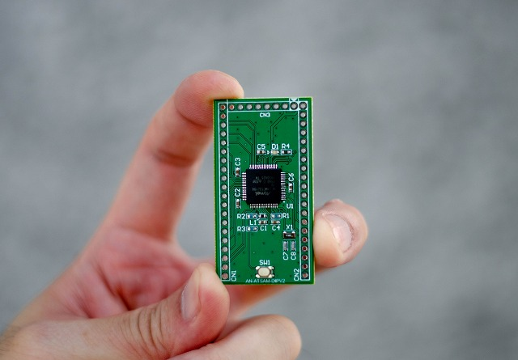
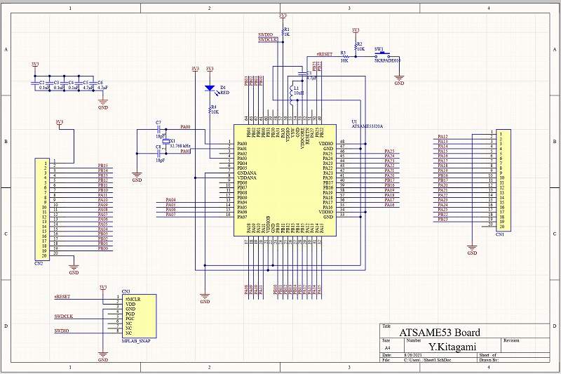
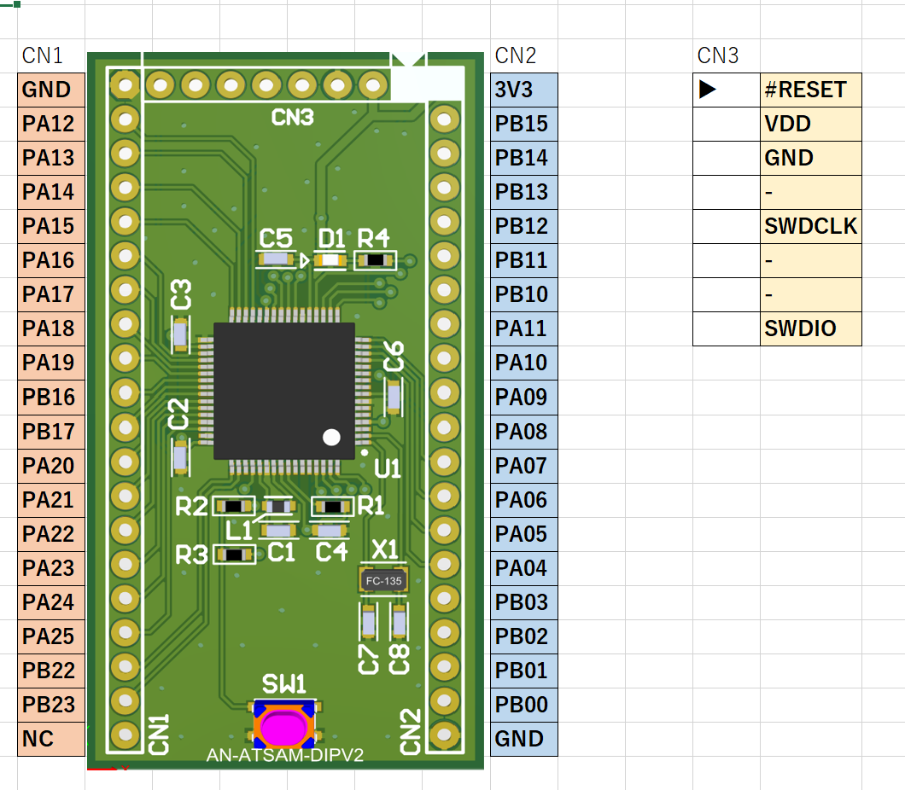

# ATSAME53 マイコン開発ボード

# ■ 概要

Microchip(旧Atmel)社が販売している 32bit ARM Cortex-M4Fコアを搭載したATSAME53を、手頃に試せるマイコンボードです。

使いやすい様に、電源や水晶等の外部回路を搭載し、ユニバーサル基板で開発が可能にしました。

純粋なマイコン開発を行う際にオススメです。

Microchipの開発環境 MPLABXに対応しており、ライターも安価なSNAPやPIC Kit4で書き込みできます。

PIC開発者が、ARMコアへ移行するのにオススメです。

# ■ スペック

|                      |                      |
| -------------------- | -------------------- | 
| CPU                  | ATSAME53             | 
| Core                 | 32bit ARM Cortex-M4F | 
| Program Memory (ROM) | 512 KB               | 
| Deta Memory (RAM)    | 192 KB               | 
| Clock(Max)           | 120 MHz              | 
| SERCOM(UART,I2C,SPI) | x6                   | 
| USB(Full-Speed)      | x1                   |  

# ■ 基板仕様

|            |                                 | 
| ---------- | ------------------------------- |
| 入力電源   | 3.3V                            | 
| クロック   | 基板上に32.768KHz水晶発振子搭載 | 
| GPIO       | SERCOMを基準に配置              | 
| 基板サイズ | 53.34mm x 28.45mm               |

回路図: [Schematic.pdf](Schematic.pdf)

ライターは安価なMPLAB SNAPを想定したピン配列になっています。

以前はPIC用に作られていたMicrochipのライターも、今ではAtmelのARMコアのライターとしても使用できます。

PIC-Kit4とSNAPに対応し、SWD端子を用いてご利用中のデバック環境でも開発ができます。

# ■ ピンアサイン

# ■ 参考記事

